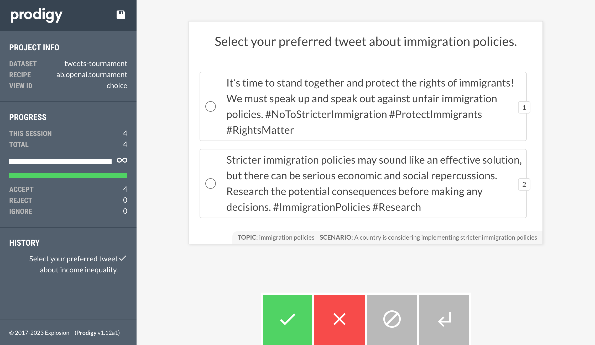

# Prodigy Tournament on Created Tweets: Inform or Virality

This project is an experiment on generated tweets with a tournament on two prompts.

Prompt 1 is intended to educate and inform the reader on a topic.

Prompt 2 is intended to elicit attention with the goal to become viral and get more likes.

There were six themes created, each with 10 topics.

1. Professional sports teams
2. World politicans
3. Consumer products
4. Famous celebrities
5. Technology/AI
6. Social causes and activism

## Setup

Create `.env` file with:

```
PRODIGY_KEY=xxxx-xxxx-xxxx-xxxx
PRODIGY_OPENAI_KEY="sk-xxxxxxxxxxxxxxx"
PRODIGY_OPENAI_ORG="org-xxxxxxxxxxxxxx"
```

To install packages, run:

```
make install
```

## Run tournament

To run the tournament, run:

```
make prodigy-tournament-tweets
```

This command runs:

```
prodigy ab.openai.tournament tweets-tournament topics.jsonl display-template.jinja2 prompt_folder
```

